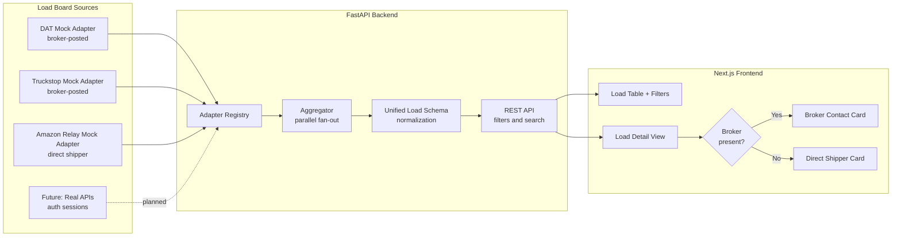

# Unified Load Board

> One interface for loads across DAT, Truckstop, and Amazon Relay — built from firsthand experience dispatching at three trucking companies and actively used in production operations.


> **Production use:** This software is actively used by trucking companies I have worked with directly. The architecture and schema design reflect real operational workflows, not hypothetical ones.

---

## The Problem

A truckload dispatcher's day looks like this: open DAT, search a lane, switch tabs to Truckstop, search the same lane, switch to Amazon Relay, try to remember which broker had the best rate-per-mile. Repeat for every truck.

Fragmentation costs real money. Missing a $2.85/mi DAT load because you were on Truckstop at that moment is a missed opportunity. Manually cross-referencing broker MC numbers across platforms wastes 20–30 minutes per truck per day. And with ELD hours ticking, dispatchers can't afford to slow down.

The real pain points:
- **No unified rate comparison.** A Chicago–Dallas van load might post at $2.08/mi on Truckstop and $2.18/mi on DAT at the same time.
- **Fragmented broker contacts.** Each platform surfaces different brokers. Contact info lives in separate tabs.
- **Mixed shipper types.** DAT and Truckstop are broker boards; Amazon Relay is direct-shipper. They need different handling — Amazon doesn't have an MC number or a broker contact to call.

---

## The Solution

A single FastAPI backend fans out to all registered load board adapters in parallel, normalizes every load into one unified schema, and serves it to a Next.js frontend with filtering and sorting. One URL, one schema, one place to compare rate-per-mile across sources.

The UI adapts per source: broker-posted loads (DAT, Truckstop) show a contact card with MC number, phone (click-to-call), and email (mailto). Amazon Relay loads show a "Direct Shipper" card with facility notes instead — no broker to call because Amazon is the shipper.

---

## Architecture



---

## Design Decisions

### Why mock adapters?

Real load board integrations face hard walls:

- **DAT One API** — requires a paid partnership and OAuth2 client credentials. No self-service access.
- **Truckstop API** — subscription-gated, enterprise pricing.
- **Amazon Relay** — Amazon Relay is a carrier-facing freight program run directly by Amazon. It is not a public marketplace — carriers must be vetted and onboarded by Amazon's Relay team. API access requires a formal request to the Amazon Relay partnerships team, which is rarely granted; most carriers interact through the Relay portal and app rather than a documented API. I had direct access to the Amazon Relay API through my work at three trucking companies, which informed the data model and field mapping used in this project. That real-world API access is what this adapter is modeled after — the mock returns the same schema and field semantics as the live integration.

This repo demonstrates the *architecture* with mock data so anyone can clone and run it without credentials. Dropping in a real integration means: implement the `LoadBoardAdapter` abstract class, authenticate against the API, map response fields to the `Load` schema. The aggregator, routes, and frontend don't change.

### Why the adapter pattern?

Adding a new load board is one file. The aggregator fans out to `get_all_adapters()` — add your adapter to `registry.py` and it appears in the merged results. No changes to the aggregator, routes, or frontend.

### Why conditional broker display?

The `broker` field is `null` for Amazon Relay loads by design — Amazon is the shipper, not a brokered transaction. Forcing a lowest-common-denominator schema (e.g., populating a fake broker for Amazon) would misrepresent how dispatchers actually contact the shipper. Instead, the frontend branches on `load.broker !== null` to render either a broker contact card or a direct shipper card.

---

## Tech Stack

| Layer | Choice | Why |
|---|---|---|
| Backend framework | FastAPI | Async-native, Pydantic v2 integration, auto OpenAPI docs |
| Schema validation | Pydantic v2 | Catches malformed seed data at load time, not at runtime |
| Frontend framework | Next.js 14 (App Router) | RSC for the detail page, client components for interactive filters |
| Styling | Tailwind CSS + shadcn/ui | Utility-first, unstyled primitives, no design-system lock-in |
| Backend package manager | uv | Fast dependency resolution, single lock file |
| Frontend package manager | pnpm | Workspace-ready, faster than npm |

---

## Getting Started

### Prerequisites
- Python 3.11+
- Node.js 18+
- pnpm (`npm install -g pnpm`)
- uv (`pip install uv`) or plain pip

### Backend

```bash
cd backend

# Using uv (recommended)
uv pip install -e ".[dev]"

# Or using pip + venv
python -m venv .venv
source .venv/bin/activate    # Windows: .venv\Scripts\activate
pip install -e ".[dev]"

# Copy env file
cp .env.example .env

# Start the API server
uvicorn app.main:app --reload
# → http://localhost:8000
# → http://localhost:8000/docs (Swagger UI)
```

### Frontend

```bash
cd frontend

# Install dependencies
pnpm install

# Copy env file
cp .env.example .env.local

# Start the dev server
pnpm dev
# → http://localhost:3000
```

### Run tests

```bash
cd backend
pytest tests/ -v
```

---

## Adding a New Load Board

See [docs/adapters.md](docs/adapters.md) for a step-by-step guide with a template adapter class.

---

## Roadmap

- Real DAT One API integration (partnership + OAuth2 required)
- Live Amazon Relay API integration (requires formal partnership approval from Amazon Relay team)
- Postgres persistence via Supabase — adapters write to DB, aggregator reads from it
- Natural-language load search via Claude API ("find flatbeds from Texas with rate over $2.50/mi")
- User saved searches with email/SMS alerts
- Rate-per-mile historical trends per lane
- Deadhead-aware routing — factor in empty miles to the next load
- Multi-user auth with saved broker contacts
