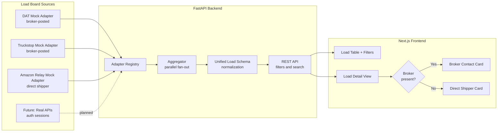

# Architecture

## Overview

The Unified Load Board is organized as two independent services that communicate over HTTP:

1. **FastAPI backend** — adapter registry, parallel aggregator, REST API
2. **Next.js frontend** — load table with filters, detail view with conditional contact rendering

## Component Diagram



## Backend Deep-Dive

### Unified Load Schema (`app/schemas.py`)

Every load board adapter must produce a `Load` object conforming to this schema, regardless of what the source API returns. This is the core contract of the system. Fields:

- `id` — prefixed by source (`dat_00042`, `ts_00001`, `ar_00003`) so IDs are globally unique and the source can be inferred without a DB lookup.
- `broker` — `BrokerContact | None`. `None` signals a direct-shipper load; the frontend branches on this.
- `rate_total_usd` and `rate_per_mile_usd` — both `float | None`. `None` means "call for rate" — common for high-value or specialized loads.

### Adapter Pattern (`app/adapters/`)

```
LoadBoardAdapter (abstract)
├── DATMockAdapter
├── TruckstopMockAdapter
└── AmazonRelayMockAdapter
```

Each adapter is responsible for:
1. Fetching raw data from its source (network call, DB read, or file read for mocks)
2. Normalizing to `Load` objects
3. Applying filters (via `_apply_filters` in the base class, or at the source level for real APIs)

The `_apply_filters` helper in the base class handles in-memory filtering for mock adapters. A real API adapter should push filters into the query (e.g., DAT One API accepts origin/destination parameters) to avoid pulling thousands of loads over the wire.

### Aggregator (`app/aggregator.py`)

Uses `asyncio.gather` to fan out to all adapters in parallel. For mock adapters reading from disk this is fast; for real API adapters with network latency, parallelism matters — a 300ms DAT call and a 400ms Truckstop call together take ~400ms, not 700ms.

After merging, results are sorted by `posted_at` descending (newest first). Filtering by `source` happens before the gather — no point fetching from an adapter the user excluded.

### Adapter Registry (`app/adapters/registry.py`)

Single source of truth for which adapters are active. Adding a new load board:
1. Create `backend/app/adapters/newboard_mock.py`
2. Add one line to `registry.py`
3. The aggregator, routes, and frontend automatically include it

### API Routes (`app/routes/loads.py`)

Three endpoints:
- `GET /api/loads` — fan-out, filter, sort, return list
- `GET /api/loads/{id}` — infer source from ID prefix, look up in that adapter's data
- `GET /api/sources` — current load counts per adapter (useful for the header "X of Y loads" display)

## Frontend Deep-Dive

### Filter State and URL Sync (`app/page.tsx`)

Filters are stored in React state and mirrored to URL query parameters using `router.replace`. This means filter state survives a page refresh and links are shareable — a dispatcher can send a colleague a link to "flatbeds from TX over $2000".

### Conditional Broker Rendering (`app/loads/[id]/page.tsx`)

The detail page is a React Server Component that fetches the load server-side. It branches on `load.broker !== null`:

- **Broker present** → `<BrokerContactSection>` — company name, MC number, click-to-call phone, mailto email
- **Broker null** → `<DirectShipperSection>` — source badge + facility notes from the `notes` field

This models reality: Amazon Relay dispatchers don't call a broker, they use the Relay app and follow the facility notes.

### Data Flow

```
User selects filter → URL updates → fetchLoads(filters) called
                                        ↓
                              FastAPI /api/loads?...
                                        ↓
                              Aggregator fans out to adapters
                                        ↓
                              Merged, filtered, sorted Load[]
                                        ↓
                              LoadTable renders rows
                                        ↓
                              User clicks row → /loads/dat_00042
                                        ↓
                              Server fetches GET /api/loads/dat_00042
                                        ↓
                              Load detail + conditional contact card
```
